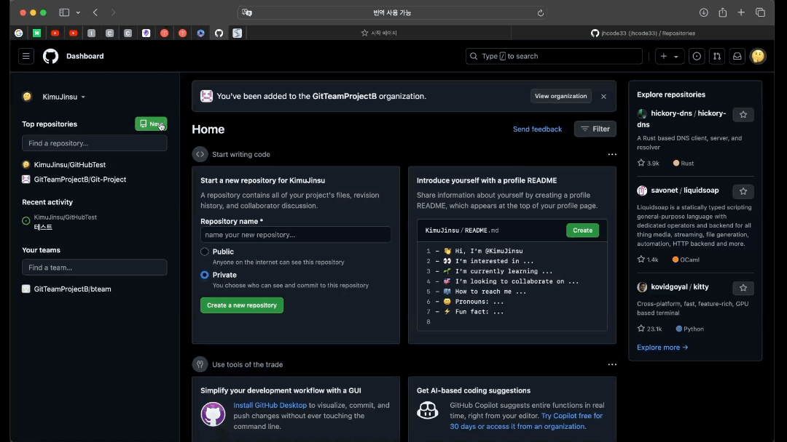
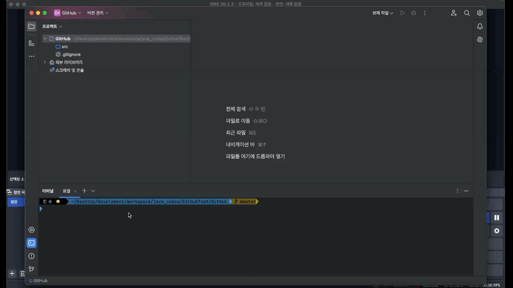
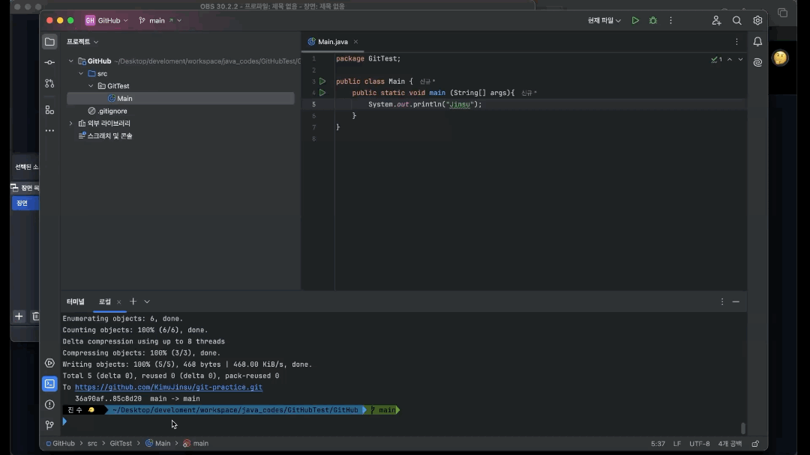
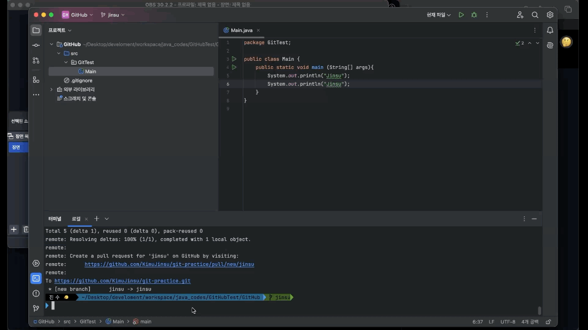
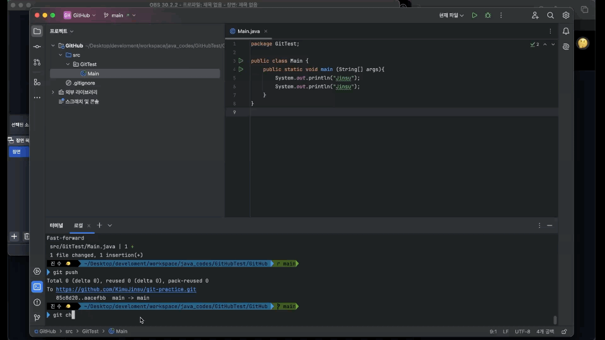
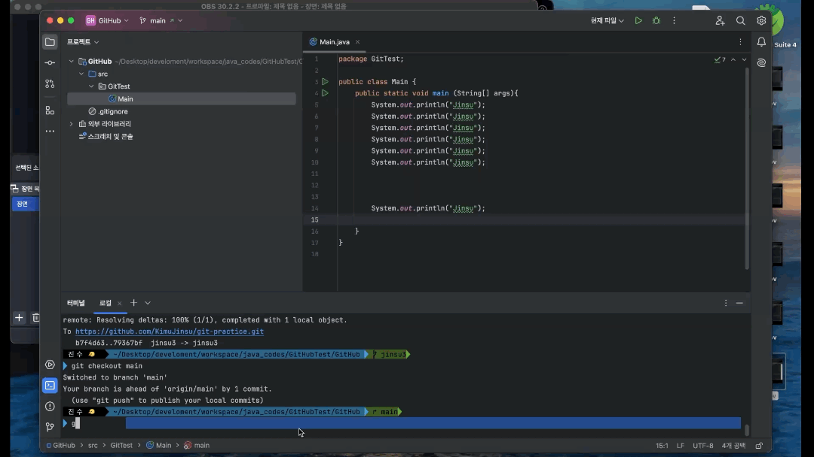
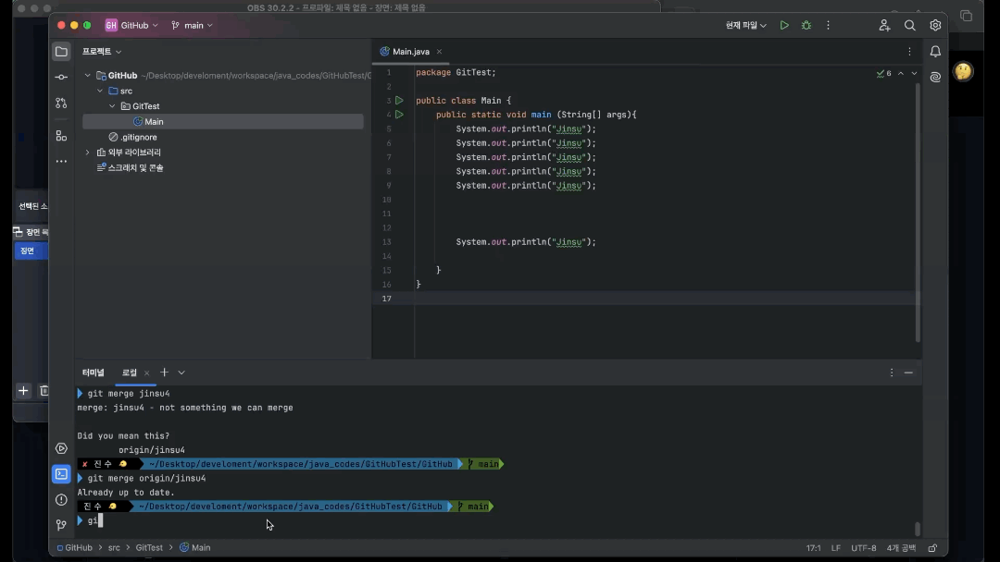
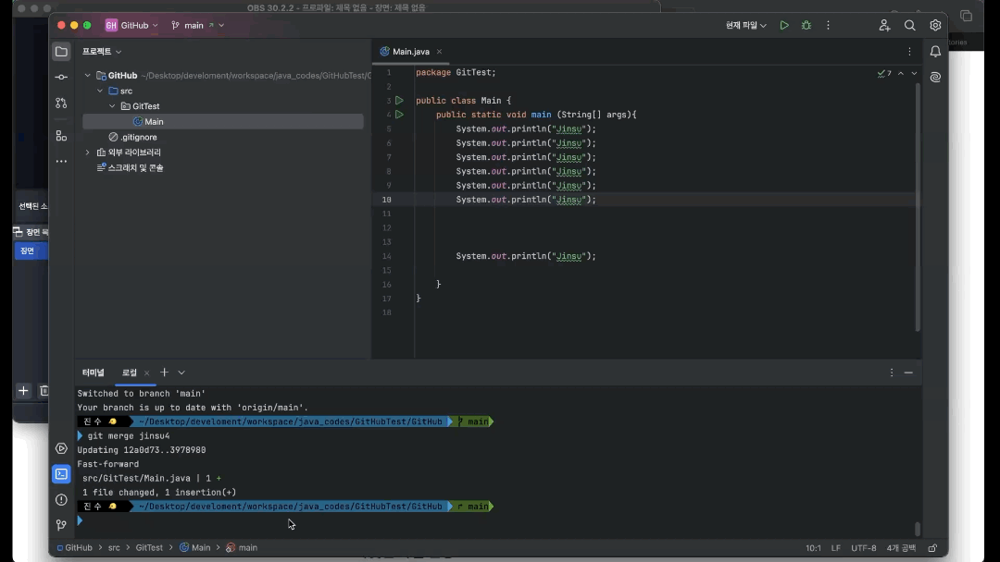
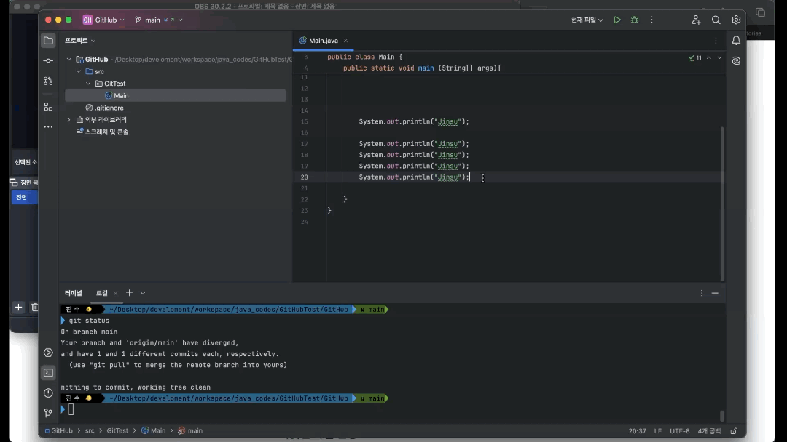

# 실습내용
* * *
1. remote[GitHub] empty repo 생성 
2. git init & git push 
3. 별도의 git local branch 생성 -> remote repo 생성 
4. fast forward merge 
5. 3 way merge - conflict merge가 발생해야 함 
6. rebase - conflict merge가 발생해야 함 
7. remote branch[GitHub]와 local branch 충돌 해결 
8. local branch 및 remote branch 삭제 
9. git undo[amend 옵션 사용] 
* * *
# remote[GitHub] empty repo 생성
* * *

* * *
# git init & git push
* * *

* * *
# 별도의 git local branch 생성 -> remote repo 생성
* * *

* * *
# fast forward merge
* * *

* * *
# 3 way merge - conflict merge가 발생해야 함
* * *

* * *
# rebase - conflict merge가 발생해야 함
* * *

* * *
# remote branch[GitHub]와 local branch 충돌 해결
* * *

* * *
# local branch 및 remote branch 삭제
* * *

* * *
# git undo[amend 옵션 사용]
* * *

